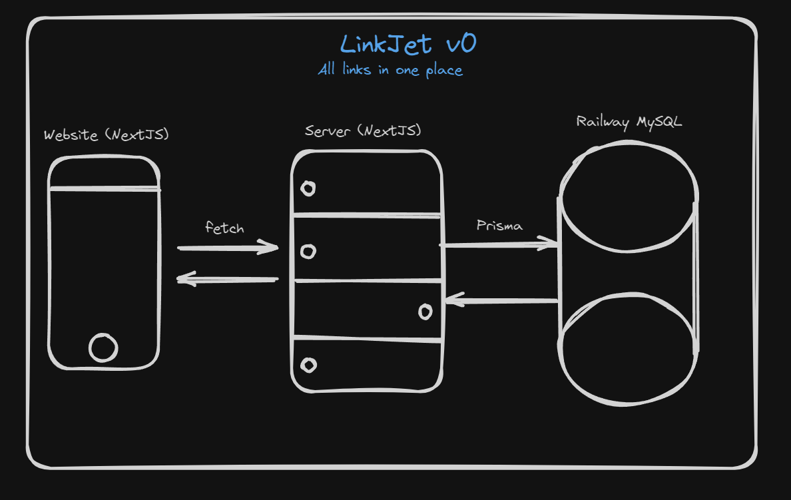

# LinkJET

All links in one place

## Table of Contents

- [Folders](#folders)
- [Link](#link)
- [Architecture](#architecture-v0)

## Folders

Links are grouped in folders for different activites

- School
- Work
- Spare time
- Custom Folder

## Link

Each link will constist of

- Name
- URL
- Description (for adding more information)

## Technologies

- NextJS
- Prisma
- MySQL

## Architecture v0

